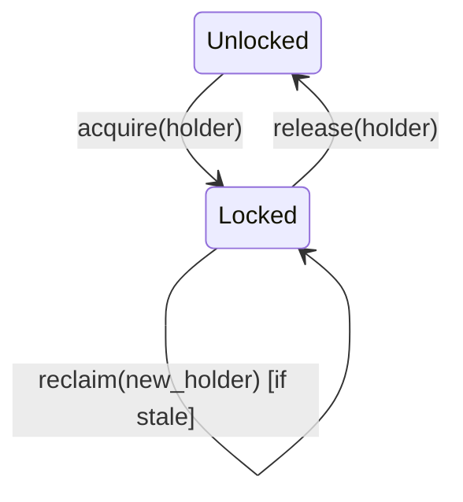
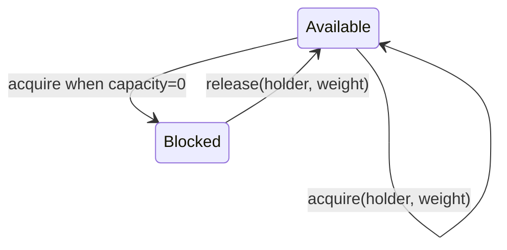
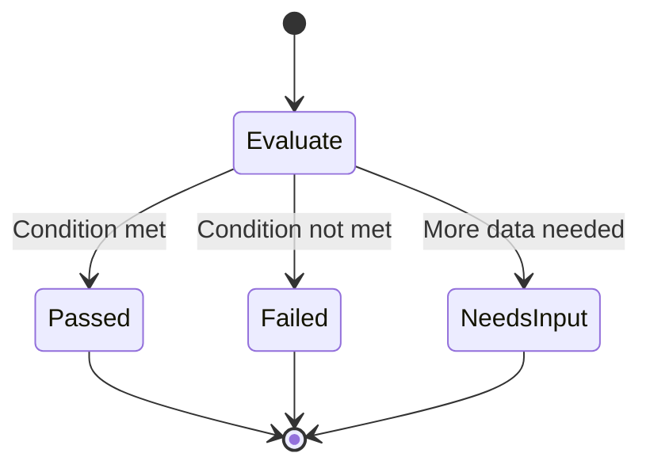

# Coordination Module

Distributed resource management primitives for multi-worker systems.

## State Machine Invariants

### Lock Invariants

```
INVARIANT: A lock has at most one holder at any time
INVARIANT: Stale locks (no heartbeat for `stale_after`) can be reclaimed
INVARIANT: Lock state transitions are atomic
```



### Semaphore Invariants

```
INVARIANT: Sum of holder weights <= capacity
INVARIANT: Stale holders are removed on tick()
INVARIANT: Weight must be > 0
```



### Guard Invariants

```
INVARIANT: Guards are evaluated atomically
INVARIANT: NeedsInput returns specific data requirements
INVARIANT: Composition (and/or) preserves invariants
```



## Effect Ordering

Coordination effects must execute in causal order:
1. `CheckGuard` before `AcquireLock`
2. `AcquireLock` before `StartWork`
3. `ReleaseResource` after work completion

## Landing Checklist

- [ ] State transitions are deterministic (same input -> same output)
- [ ] Invariants documented in code comments
- [ ] Property tests for state machine transitions
- [ ] Staleness thresholds are configurable
