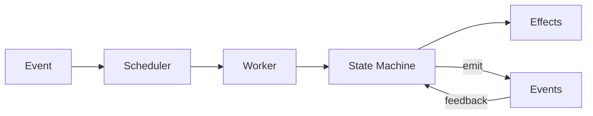

# Engine Module

Core execution orchestration: scheduler, workers, and effect execution.

## Effect System Invariants

### Effect Ordering Rules

```
INVARIANT: Effects execute in causal order
INVARIANT: Effects are data (not functions) - serializable and inspectable
INVARIANT: Effect execution never blocks the event loop
INVARIANT: Failed effects produce error events (not panics)
```

### Execution Flow



### Executor Invariants

```
INVARIANT: One effect executes at a time per worker
INVARIANT: Effects with dependencies wait for prerequisites
INVARIANT: Checkpoint effects block until persistence confirmed
```

### Effect Categories

| Category | Blocking | Example |
|----------|----------|---------|
| State mutation | No | `UpdateTaskState` |
| External I/O | Yes (async) | `CreateWorktree`, `SendCommand` |
| Persistence | Yes | `SaveCheckpoint` |
| Notification | No | `EmitEvent` |

### Recovery Invariants

```
INVARIANT: Recovery replays from last checkpoint
INVARIANT: Idempotent effects can safely re-execute
INVARIANT: Non-idempotent effects check preconditions
```

## Landing Checklist

- [ ] New effects are data structures (not closures)
- [ ] Effect handlers are async
- [ ] Error events emitted on failure
- [ ] Recovery path tested
