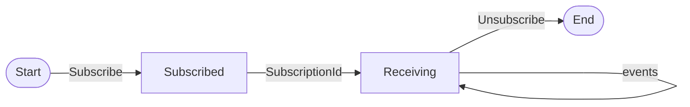

# Events Module

Event routing, subscriptions, and audit logging.

## Event System Invariants

### EventBus Invariants

```
INVARIANT: Events are delivered at-least-once
INVARIANT: Subscribers receive events matching their pattern
INVARIANT: Event delivery does not block publisher
```

### Pattern Matching

```
"workspace:*"     - All workspace events
"task:stuck"      - Specific event
"pipeline:build:*" - All build pipeline events
```

### EventLog Invariants

```
INVARIANT: All events are logged (audit trail)
INVARIANT: Log entries are immutable
INVARIANT: Timestamps use monotonic clock
```

### Subscription Lifecycle



## Landing Checklist

- [ ] Events are serializable (for logging)
- [ ] Patterns use consistent naming (noun:verb or noun:adjective)
- [ ] Subscriptions cleaned up on worker shutdown
