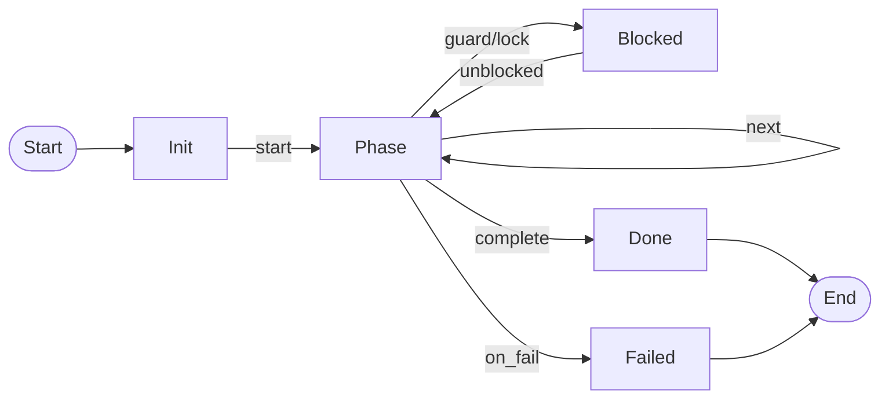

# Pipelines Module

See also [docs/04-architecture/09-pipeline-state-machine.md](/docs/04-architecture/09-pipeline-state-machine.md).

Workflow state machines for runbook-driven dynamic pipelines.

## Pipeline State Machine Pattern

All pipelines follow the pure state machine pattern:

```rust
fn transition(state: &State, event: Event) -> (State, Vec<Effect>)
```

### Invariants

```
INVARIANT: Transitions are pure functions (no I/O)
INVARIANT: Same (state, event) always produces same (state', effects)
INVARIANT: Terminal states produce no effects
INVARIANT: Effects capture all side effects
```

## Pipeline States



## Landing Checklist

- [ ] State transitions are exhaustive (all cases handled)
- [ ] Property tests verify transition determinism
- [ ] Terminal states are explicit
- [ ] Effects are minimal and necessary
