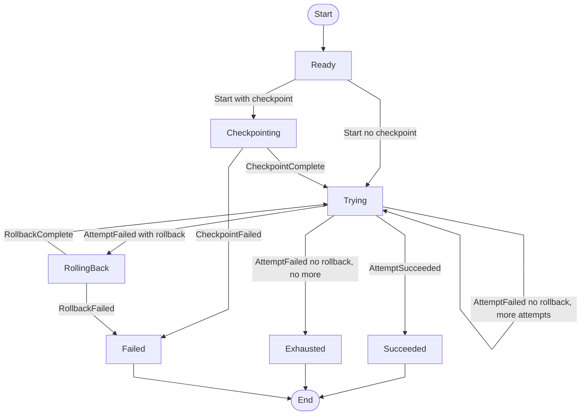

# Strategy Module

See also [docs/04-architecture/08-strategy-state-machine.md](/docs/04-architecture/08-strategy-state-machine.md).

A pure functional state machine for fallback chains with checkpoint/rollback semantics.

## Overview

The Strategy primitive executes a sequence of approaches (attempts) until one succeeds. Key features:

- **Checkpoint**: Optionally capture state before attempting (e.g., `git rev-parse HEAD`)
- **Ordered attempts**: Tries approaches in sequence
- **Rollback**: If an attempt has a rollback command, it runs before trying the next approach
- **Exhaustion handling**: Configurable action when all attempts fail (escalate, fail, retry)

## State Machine

## Landing Checklist

- [ ] New effects are data structures (not closures)
- [ ] Effect handlers are async
- [ ] Error events emitted on failure
- [ ] Recovery path tested
